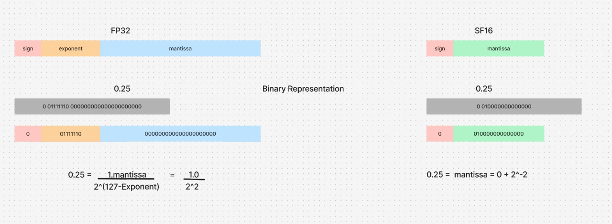
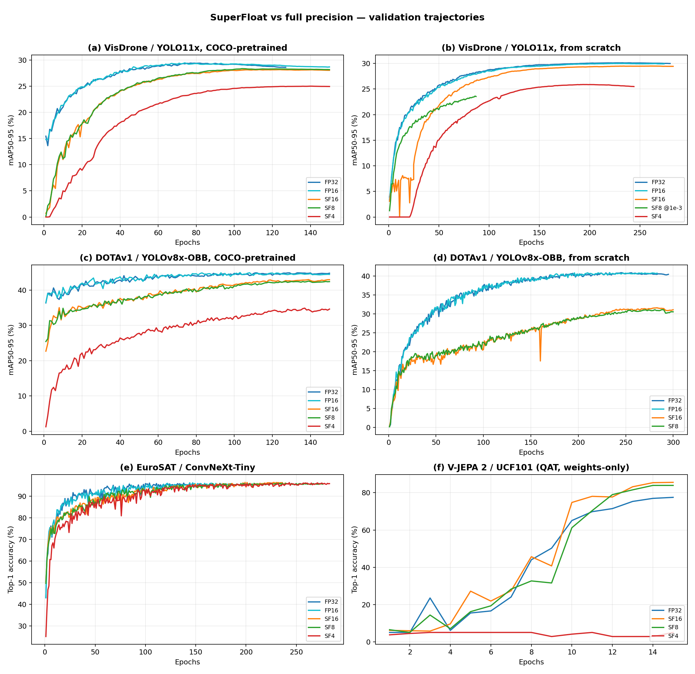
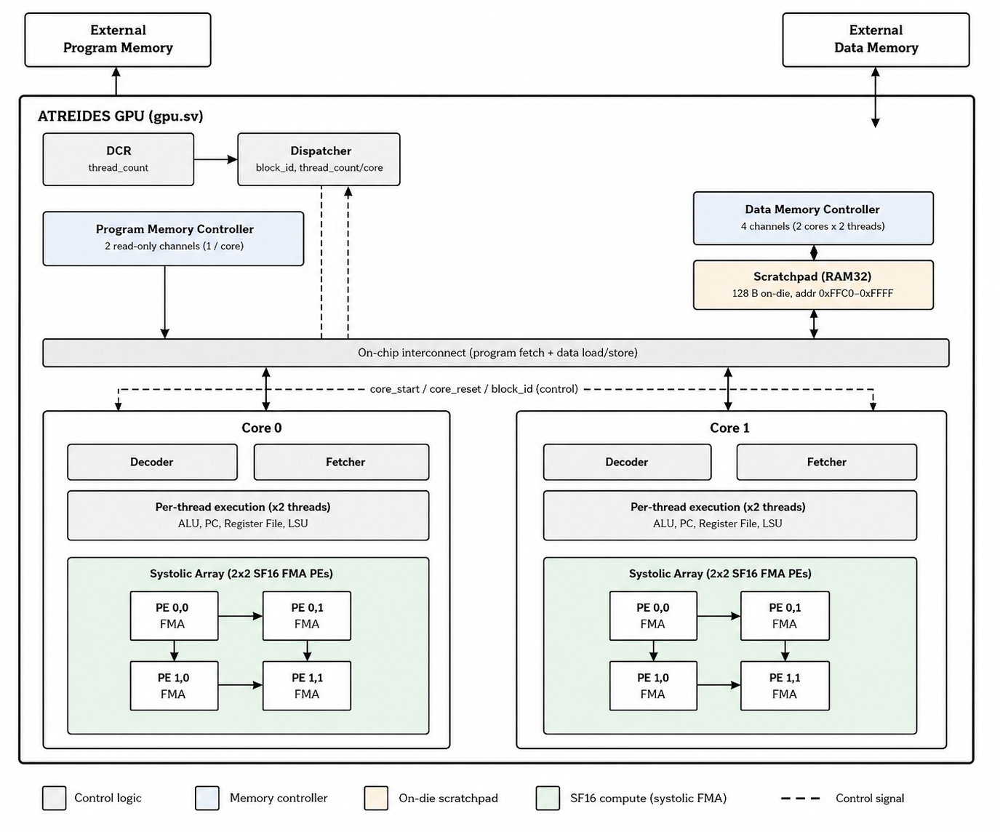
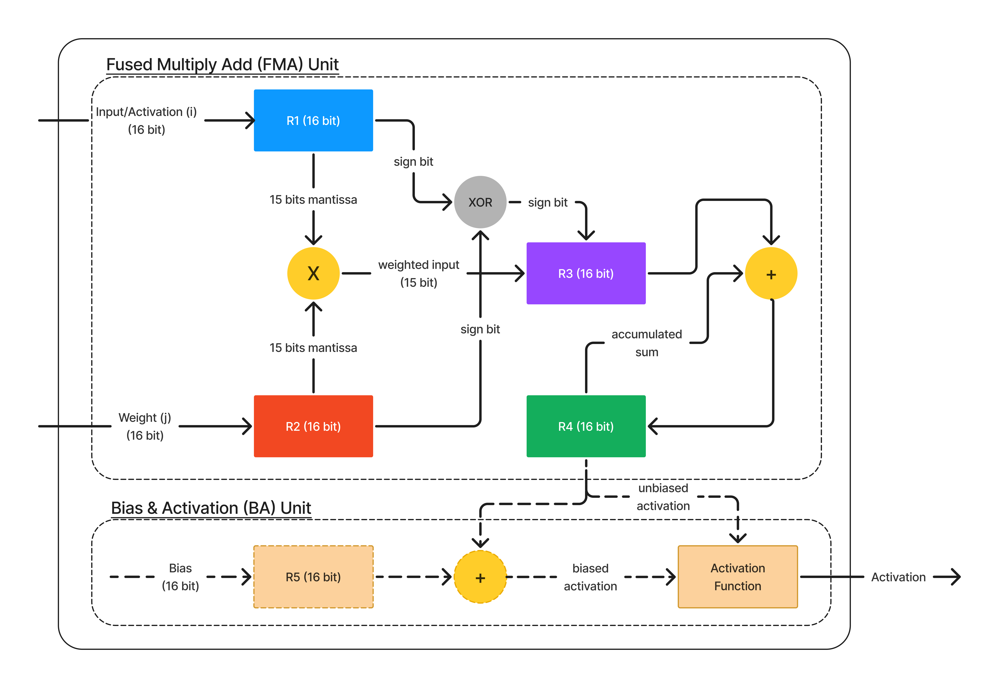

# Superfloat: Accelerators for AI on Edge. Reimagined.

Superfloat (SFx) is a parameter-aware numeric schema for deep learning
inference: it discards the exponent field entirely and spends every bit beyond
the sign on the significand. The premise is a measured property of trained
networks rather than an approximation of floating point — weights are bounded
and concentrated near zero, so the dynamic range an exponent buys is largely
unused at inference time.

This repository holds the format definition, the training and benchmark suite,
the measured results, and a scaling study of 878 archived runs that establishes
where the usable precision floor actually comes from. The silicon, the compiler
and the website live in their own repositories:

| Repository | What it is |
| --- | --- |
| [superfloat.gpu](https://github.com/aloshdenny/superfloat.gpu) | Atreides — the Q1.15 (SF16) accelerator RTL, ISA and Sky130 hardening |
| [superfloat.llvm](https://github.com/aloshdenny/superfloat.llvm) | Clang/LLVM fork adding `sf16` as a first-class builtin type |
| [superfloat-site](https://github.com/aloshdenny/superfloat-site) | Project website |
| [superfloat.cuda](https://github.com/aloshdenny/superfloat.cuda) | CUDA/C++ kernels |

---

## What is Superfloat?

SFx allocates **1 sign bit and `x−1` significand bits. There is no exponent
field and no integer bit.** This makes SFx mathematically identical to a signed
fixed-point format, Q1.(x−1):

```
value = (−1)^sign × Σ b_i · 2^(−i)      for i = 1 … x−1
```

| Format | Notation | Scale | Representable range |
| --- | --- | --- | --- |
| SF16 | 1.15 | 2^15 = 32768 | ±0.999969482421875 |
| SF8 | 1.7 | 2^7 = 128 | ±0.9921875 |
| SF4 | 1.3 | 2^3 = 8 | ±0.875 |

The schema is defined for any bit width; intermediate members such as SF14 or
SF6 are constructed identically. SF16, SF8 and SF4 are the three points carried
through to hardware and evaluated here.

Every SFx variant is backward compatible: exact conversion without additional
quantization is possible when the source floating point format provides at
least `x−1` effective significand bits.

**Why this works.** Measured across trained model families, ~99.999% of
parameters already fall inside `[−1, 1]` — 0 of 53.6M YOLO11x weights fall
outside SF16's range, and only 15 outside SF4's tighter ±0.875. The exponent is
paying for range that trained weights do not use.

> **This does not generalise to every trained network, and the exception is
> load-bearing.** SmolLM2-360M has weights reaching `|w| = 7.47`. Only ~0.01%
> exceed the bound, but they are the largest-magnitude weights in the model and
> clipping them destroys it **even at SF16**, where precision is plainly not
> the issue. Any layer whose weights are quantized without a per-channel scale
> must have its range checked against the actual checkpoint rather than assumed.
> See [TOOL_USE_QAT.md](TOOL_USE_QAT.md) section 2.



---

## Benchmarks

[`benchmarks/`](benchmarks/) evaluates SFx across four architecture families
with FP32 and FP16 reference rows trained in the same pipeline, so the
quantization cost is measured rather than cited. Full tables and failure-mode
analyses: [SUPERFLOAT_RESULTS.md](SUPERFLOAT_RESULTS.md). Scripts and Modal
apps: [benchmarks/README.md](benchmarks/README.md).

A second study asks how the usable precision moves with model width, depth,
parameter count and training tokens: [SCALING_LAWS.md](SCALING_LAWS.md), 878
archived runs across four tiers and eight follow-ups. Its result reframes
everything below.

A third asks what it takes to run a tool-calling model on SF-only hardware:
[TOOL_USE_QAT.md](TOOL_USE_QAT.md). Short answer for SF8, no training at all,
and the 1.5B BFCL result holds from 1.7B to 8B. It also corrects the range
claim made further down this page.

A fourth asks whether those numbers survive a *pure* SF datapath, saturating
every register the way the accelerator does, rather than quantizing weights
only: [PURE_SF.md](PURE_SF.md). Per-token scale is the first granularity that
keeps the model alive.

A fifth is domain evals beyond tool-call loss: known-class segmentation,
promptable SAM, and a public C→C++ compile-pass proxy.
[DOMAIN.md](DOMAIN.md). YOLO-seg PTQ collapses; box-prompt SAM does not.



### Results measured in this repository

| Domain | Model | Dataset | SF16 vs FP32 |
| --- | --- | --- | --- |
| Remote sensing classification | ConvNeXt-Tiny | EuroSAT | **+0.1%** (96.43 vs 96.31) |
| UAV object detection | YOLO11x | VisDrone | −4.3% (0.2817 vs 0.2942) |
| Satellite object detection | YOLOv8x-OBB | DOTAv1 | −4.2% (0.4298 vs 0.4489) |
| Video, self-supervised ViT | V-JEPA 2 ViT-L | UCF101 | **+8.1%** (85.56 vs 77.51) |

- **SF8 is indistinguishable from SF16** in every domain (<1% apart, in both
  directions) — 7 significand bits suffice, for a 75% storage reduction.
- **SF8 and SF16 beat full precision on V-JEPA 2** under weights-only
  quantization: 83.91 and 85.56 against an FP32 control at 77.51, on identical
  schedules.
- **SF4 is free on classification** (96.27 ±0.03 vs FP32's 96.31 ±0.55, at
  87.5% storage reduction) but costs 15–22% on dense localisation.

### Failure modes, and which ones survived scrutiny

**Weight quantization is architecture-agnostic; activation quantization is
not.** Clamping activations to [−1, 1] is nearly free after BatchNorm, which
holds CNN activations near unit scale. A ViT residual stream accumulates across
24 blocks: measured max |a| = **256.1**, with **26.3%** of activations outside
the bound across 193 of 292 layers. Quantization-aware training does not
recover it. *Confirmed and quantified* by the scaling study, which finds
activations need SF6 where weights need SF3–SF4, with clipping — not grid
coarseness — as the mechanism.

**Kaiming init places weights below the grid floor.** Standard init puts
weights an order of magnitude under SF4's 0.0625 step, zeroing **99.98%** of
them at step 0. *Confirmed, and now fixed:* per-channel normalisation before
quantization removes the `fan_in` dependence entirely, and the scale is
absorbed by the neighbouring norm so inference arithmetic stays pure SF. This
is the single change that moves the CNN floor from SF5–SF6 to SF2.

**~~Usable learning rate must match grid resolution.~~ Retired — it does not
reproduce.** This README previously reported that SF8 from random init diverges
at the FP32 recipe's 4e-3 and trains only at 1e-3, its grid being 256× coarser
than SF16's. A dedicated sweep of 60 cells — six precisions crossed with ten
learning rates spanning 1e-4 to 6e-2, a 640× range, in the same plain condition
with no normalisation — found **not one divergence at any precision**, and the
accuracy optimum at 4e-3 for SF4, SF6, SF8 and SF16 alike. SF3's optimum is
8e-3, *twice* SF16's rather than a fraction of it. The curves differ in height,
not in position.

What the sweep does not do is explain the original observation; the recipes
differ in optimiser, schedule, dataset and model, and nothing isolates which.
The practical consequence stands either way: **precision and learning rate can
be tuned independently**, so an FP32 recipe transfers to SF4 without a
learning-rate search.

### Prior results from the paper

The tables below are from the SuperFloat paper, not re-measured here. They
cover ResNet depths on CIFAR and ImageNet, and the GPT-2/GPT-3 weight
distribution and convergence studies in [assets/results](assets/results/).

**CIFAR-10 top-1 (%), mean ± std over 3 seeds**

| Format | R20 | R32 | R44 | R56 |
| --- | --- | --- | --- | --- |
| FP32 | 87.4 ±0.1 | 87.7 ±0.1 | 88.4 ±0.2 | 88.5 ±0.3 |
| FP16 | 87.4 ±0.1 | 88.0 ±0.1 | 88.3 ±0.4 | 88.6 ±0.2 |
| SF16 | 86.9 ±0.3 | 86.8 ±0.3 | 71.5 ±10.4 | 47.1 ±12.0 |
| SF8 | 86.8 ±0.2 | 86.9 ±0.1 | 82.7 ±0.5 | 74.1 ±9.9 |
| SF4 | 86.5 ±0.3 | 86.2 ±0.2 | 83.7 ±0.3 | 77.7 ±0.1 |

**CIFAR-100 top-1 (%), mean ± std over 3 seeds**

| Format | R20 | R32 | R44 | R56 |
| --- | --- | --- | --- | --- |
| FP32 | 56.7 ±0.1 | 58.1 ±0.6 | 58.8 ±0.2 | 59.0 ±0.2 |
| FP16 | 57.0 ±0.2 | 58.0 ±0.3 | 58.4 ±0.1 | 58.7 ±0.2 |
| SF16 | 52.7 ±0.7 | 55.4 ±0.3 | 17.3 ±8.1 | 15.5 ±9.2 |
| SF8 | 52.7 ±0.4 | 55.8 ±0.4 | 38.4 ±6.7 | 29.3 ±6.1 |
| SF4 | 51.7 ±0.3 | 54.4 ±0.5 | 48.6 ±1.4 | 36.8 ±1.8 |

**ImageNet-1K top-1 (%), single seed, 50 epochs**

| Format | R20 | R32 | R44 | R56 |
| --- | --- | --- | --- | --- |
| FP32 | 69.4 | 74.3 | 77.3 | 72.6 |
| FP16 | 69.95 | 74.5 | 74.5 | 72.8 |
| SF16 | 69.08 | 65.1 | 62.2 | 63.8 |
| SF8 | 69.17 | 74.1 | 63.9 | 63.5 |
| SF4 | 66.25 | 69.2 | 65.5 | 64.3 |

**Language models.** GPT-2 (124M) and GPT-3 (125M) trained on Fineweb-100B for
1 epoch; weight-distribution plots for GPT-2/3, Llama-2-7B, Mistral-7B,
Qwen2-7B, MiniCPM-V and Japanese StableLM are in
[assets/results/LLM Distribution](assets/results/LLM%20Distribution/), with
YOLOv5/v7 layer-wise distributions alongside them.

The benchmarks in this repository extend that picture in one important way: the
CIFAR tables show SFx destabilising at depth with large seed variance
(SF16 at R56: 47.1 ±12.0), whereas the modern-architecture results here are
stable, and the instabilities that do appear have identified, reproducible
causes rather than seed dependence.

---

---

## Scaling laws: precision was never the binding constraint

The floors reported in the benchmark tables — SF6 for QAT, SF8 for PTQ, total
collapse below SF4 — are **not properties of the number format**. They are
artefacts of trained weights sitting far below the grid step. Kaiming
initialisation sets `sigma = sqrt(2/fan_in)`, which shrinks as layers widen
while the SF grid stays fixed, so wide layers start entirely inside the first
quantization bin. Measured at initialisation, under plain SF every layer with
`fan_in >= 144` is **100% dead at SF3**: the network is an exactly zero
function and no gradient can revive it.

Divide each weight by its per-channel maximum before quantizing, and the
dependence vanishes — the dead fraction becomes flat in `fan_in` and halves
with each added bit (12.5%, 6.3%, 3.2%, 1.6% at SF3–SF6). The scale is
absorbed by the BatchNorm that follows the conv, or by the norm that feeds the
matmul in a transformer, so **it never enters the inference arithmetic**. On
Atreides that scale lives in the normalisation unit, outside the systolic
array; registers and the MAC array still compute only in SF range.

| regime | floor before | floor after |
| --- | --- | --- |
| CNN, QAT from scratch | SF5–SF6 | **SF2** — within 1.5 points of SF16 |
| Transformer, QAT from scratch | SF6 | **SF3–SF4** — 0.02–0.12 nats |
| Transformer, PTQ | SF8 | not tested |

SF2 is exactly ternary `{−0.5, 0, +0.5}` — the BitNet b1.58 operating point —
reached here without a ternary-specific training recipe.

### What else the sweeps found

- **The two operands are not symmetric.** Weights saturate at SF3–SF4;
  activations need SF6, and below that the weight precision stops mattering at
  all. The cause is clipping, not grid coarseness: activations are one-sided
  and heavy-tailed after ReLU, so a symmetric fixed-range format spends half
  its codes on values that never occur. **A datapath giving both operands the
  same width is misallocating** — it wants 3–4 bits on the weight operand and
  6 on the activation operand.
- **Width raises the precision requirement; depth does not.** Critical
  precision rises `+0.29` bits per width doubling (against `+0.50` predicted by
  the initialisation argument), but is flat across ResNet-20 to ResNet-56 —
  depth changes no layer's `fan_in`. Deeper networks simply pay a smaller
  penalty: SF2 costs 4.23 points at ResNet-20 and 1.92 at ResNet-56.
- **PTQ damage is U-shaped in training tokens**, not monotone. Both ends of a
  training run are fragile and the middle is not. The worst checkpoint to
  quantize is the one that ships: over-training a 160M model to 300B tokens
  costs **2.5 bits** of deployable precision.
- **Precision and learning rate are independent knobs** — no divergence in
  60 cells across a 640x range of step size, retiring a claim this README
  previously made (see [failure modes](#failure-modes-and-which-ones-survived-scrutiny)).
- **SF16 does not train faster than SF8.** Re-reading the Tier A LM histories,
  early val-loss slope is noise around 1× (0.95–1.05) across 5M–85M, and the
  only SF16 lead (first eval, +0.15 nats at 85M) is gone by the second. A
  staged SF16→SF8 recipe does not harvest a steeper curve; see
  [SCALING_LAWS.md Appendix A](SCALING_LAWS.md#appendix-a-sf16-does-not-train-faster-than-sf8).


Full method, tables and caveats: [SCALING_LAWS.md](SCALING_LAWS.md). Which
script produced which number, and which figure: [study map](#study-map-for-the-paper).

---

## Chip-1: Atreides

Atreides is an ASIC accelerator built for SFx inference: a Q1.15 fixed-point
GPU with a redesigned systolic array, a custom 16-bit ISA and fused
multiply-add units that carry no exponent hardware. RTL, testbenches and the
Sky130 hardening flow are in
[superfloat.gpu](https://github.com/aloshdenny/superfloat.gpu).

Silicon configuration: 2 cores × 2 threads, one 2×2 systolic array per core
(8 MAC units), 128 B address-mapped on-die scratchpad, 8×4 Tiny Tapeout tiles,
50 MHz target.



### FMA unit

The FMA is where removing the exponent pays. Sign is computed by XOR, the
significands go through a 15×15 unsigned multiply, and the result saturates
into Q1.15 with a 32-bit internal accumulator. There is no exponent-difference
barrel shifter, no leading-zero detector and no round-to-nearest-even packing.



### Measured hardening results

Post-place-and-route, Sky130 HD, 20 ns (50 MHz) constraint. All four levels
close with zero DRC, LVS and antenna violations.

| Design | WNS (ns) | Worst slack (ns) | Implied Fmax (MHz) | Core area (µm²) | Util | Power (W) |
| --- | --- | --- | --- | --- | --- | --- |
| Processing Element | 0.0 | 6.73 | 75.3 | 26268.9 | 0.691 | 0.00273 |
| Systolic Array | 0.0 | 7.62 | 80.8 | 99382.8 | 0.865 | 0.00696 |
| Core | 0.0 | 0.93 | 52.5 | 451496 | 0.288 | 0.01224 |
| Accelerator | 0.0 | 3.95 | 62.3 | 694446 | 0.545 | 0.02165 |

Against IEEE baselines hardened through the identical flow, at iso clock
period and iso library:

| Metric | SF16 PE | IEEE FP16 PE | IEEE FP32 PE |
| --- | --- | --- | --- |
| Stdcell area (µm²) | 18147.4 | 25396.9 (1.40×) | 96919.2 (5.34×) |
| Setup slack (ns) | +6.726 | +0.177 | −5.045 |
| Implied Fmax (MHz) | 75.34 | 50.45 | 39.93 |
| Meets 50 MHz | yes | yes | no (69 violating paths) |

The advantage compounds at array granularity: a 2×2 IEEE FP16 systolic array is
1.63× the SF16 array's stdcell area (139775 vs 85931.2 µm²) and misses the
50 MHz target by 0.42 ns, while the SF16 array closes with 7.62 ns of margin.

One honest caveat: at full-chip level the critical path leaves the arithmetic
datapath and lands in memory address generation, so chip-level Fmax is bounded
by the memory subsystem rather than by the numeric format.

### Instruction set

Atreides implements a 14-instruction, 16-bit ISA in a 4-field register-register
encoding. Integer ops handle indexing, addressing and control flow; FMA and ACT
are reserved for Q1.15 matrix math so accumulation precision is never lost to
the integer path.

```
[OPCODE 15:12] [Rd 11:8] [Rs 7:4] [Rt 3:0]
```

| Opcode | Mnemonic | Operands | Description |
| --- | --- | --- | --- |
| 0000 | NOP | — | No operation |
| 0001 | BRnzp | offset9 | Branch on nzp flags to PC + 1 + sign_extend(offset9) |
| 0010 | CMP | Rd, Rs | Compare integers, set nzp flags |
| 0011 | ADD | Rd, Rs, Rt | Integer add |
| 0100 | SUB | Rd, Rs, Rt | Integer subtract |
| 0101 | MUL | Rd, Rs, Rt | Integer multiply, 16-bit zero-extended result |
| 0110 | DIV | Rd, Rs, Rt | Integer divide, hardware reciprocal |
| 0111 | LDR | Rd, Rs | Load 16-bit word from data memory at address Rs |
| 1000 | STR | Rd, Rs | Store 16-bit word from Rs to address Rd |
| 1001 | CONST | Rd, imm8 | Load 8-bit sign-extended immediate |
| 1010 | FMA | Rd, Rs, Rt | Q1.15 fused multiply-accumulate: Rd = (Rs × Rt) + Rd |
| 1011 | ACT | Rd, Rs, Rt | Bias-add + activation (passthrough / ReLU / leaky / clipped) |
| 1100 | SYS | op, idx | Systolic array control (clear / load / compute / read) |
| 1111 | RET | — | Return from kernel |

Each thread owns 16 registers: `R0`–`R12` are general purpose read/write, and
`R13`–`R15` are hardwired read-only SIMD index registers (`%blockIdx`,
`%blockDim`, `%threadIdx`) that give a thread its coordinate without dedicated
addressing hardware.

Throughput: 400 × 10⁶ MAC/s across the systolic paths (8 PEs × 1 MAC/cycle ×
50 MHz), 100 × 10⁶ FMA/s on the scalar path.

---

## Compiler

[superfloat.llvm](https://github.com/aloshdenny/superfloat.llvm) is an LLVM 18
fork (branch `my-llvm-changes`) that adds `sf16` as a builtin C type rather
than a library typedef, so the format survives the whole pipeline:

- **LLVM IR** — `sf16` as a first-class type, through `Type.h`, the AsmParser,
  AsmWriter and `ValueTypes`.
- **Clang frontend** — the `sf16` keyword in `TokenKinds.def`, a builtin type
  in `BuiltinTypes.def`, plus AST, lexer, parser, `Sema` and Itanium mangling.
- **CodeGen** — 16-bit width, 15-bit scale, lowered to `i16` with fixed-point
  intrinsics for the arithmetic.
- **Target** — RISC-V, matching Atreides' modded RV32 control path.

```c
sf16 literal_test() {
    sf16 x = 0.5;
    return x;
}
```

---

## Repository layout

```
benchmarks/
  superfloat.py            SFx grid, bounded STE, layer surgery, clamping
  test_superfloat.py       correctness tests (run these first)
  train_eurosat.py         ConvNeXt-Tiny classification
  train_yolo.py            YOLO detection via Ultralytics callbacks
  train_vjepa_*.py         V-JEPA 2 PTQ probe and end-to-end QAT
  make_figures.py          evaluation figures, one uniform style
  analyze_scaling.py       logistic fit of critical precision, width law
  make_scaling_figures.py  the four-tier scaling figures
  make_lab_figures.py      the follow-up experiment figures
  build_results_archive.py folds raw run dirs into one JSONL per experiment
  lab/                     follow-up experiments (see lab/README.md)
  modal/                   Modal apps for the cloud sweeps
  results/                 every raw run, one JSONL per experiment
  figures/                 every rendered figure
cifar_modular/             ResNet CIFAR training for the paper's CIFAR tables
src/
  modal/                   GPT-2/GPT-3 pretraining under clamped matmul
  test/                    matrix/stream generators for hardware testbenches
  verilog/                 early FPGA units (superseded by superfloat.gpu)
Q115 layer story.py        layer-by-layer Q1.15 vs FP32 analysis on ResNet-20
assets/results/            weight-distribution studies, architecture figures
docs/paper/                TPAMI manuscript, anonymized main doc and title page
SUPERFLOAT_RESULTS.md      evaluation tables and failure-mode analyses
SCALING_LAWS.md            the scaling study, sections 1-8
TOOL_USE_QAT.md            tool-calling PTQ/QAT, including BFCL at 0.6B–8B
PURE_SF.md                 saturate-every-register datapath, not weights-only
DOMAIN.md                  YOLO-seg, box-prompt SAM, C→C++ proxy
```

---

## Study map, for the paper

Every claim in [SCALING_LAWS.md](SCALING_LAWS.md) traces to a script, an
archived result file and a figure. Nothing below needs a live GPU to
reproduce: both figure scripts read `benchmarks/results/`.

**Four tiers** — the original sweep, run on Modal.

| tier | question | script | results | figure | §  |
| --- | --- | --- | --- | --- | --- |
| A | QAT cost vs model size | `modal/modal_scaling_a.py` | `scaling_a.jsonl` (34) | `scaling_ab_lm.png` | 3.1 |
| B | PTQ cost vs size and data | `modal/modal_scaling_b.py` | `scaling_b.jsonl` (172) | `scaling_ab_lm.png` | 3.2–3.3 |
| C | where a network stops training | `modal/modal_scaling_c.py` | `scaling_c.jsonl` (258) | `scaling_c_width.png` | 2 |
| D | carrying the fix to transformers | `modal/modal_scaling_d.py` | `scaling_d.jsonl` (36) | `scaling_d_absorption.png` | 4 |

**Eight follow-ups** — run on single GPUs, `benchmarks/lab/`.

| # | question | script | results | figure | § |
| --- | --- | --- | --- | --- | --- |
| 1 | weight vs activation precision | `lab/exp1_act.py` | `exp1.jsonl` (42) | `lab_exp1_activation.png` | 5.1 |
| 2 | PTQ damage vs training tokens | `lab/exp2_dn.py` | `exp2.jsonl` (168) | `lab_exp2_dn_law.png` | 3.3 |
| 3 | penalty vs tokens-per-parameter | `lab/exp3_reg.py` | `exp3.jsonl` (20) | `lab_exp3_regularisation.png` | 5.4 |
| 4 | does depth move the floor | `lab/exp1_act.py --depth` | `exp4.jsonl` (48) | `lab_exp4_depth.png` | 5.5 |
| 5 | per-layer dead-weight profile | `lab/exp5_alloc.py` | `exp5_profile.jsonl` (4) | `lab_exp5_per_layer.png` | 5.2 |
| 6 | precision vs learning rate | `lab/exp6_lr.py` | `exp6.jsonl` (60) | `lab_exp6_lr_law.png` | 5.3 |
| 7 | ResNet-56 seed spread, plain SF | `lab/exp1_act.py --no-chan-norm` | `exp7.jsonl` (24) | `lab_exp7_plain_depth.png` | 5.6 |
| 8 | re-run of 4.1's lost seeds | `lab/exp8_tierd_seeds.py` | `exp8.jsonl` (12) | `lab_exp8_tierd_replication.png` | 4.1 |

**Analysis figures** not tied to a single sweep:

| figure | what it shows | produced by |
| --- | --- | --- |
| `scaling_critical_precision.png` | logistic p0 fit, width law vs Kaiming | `analyze_scaling.py` |
| `scaling_qat_vs_ptq.png` | QAT and PTQ thresholds side by side | `analyze_scaling.py` |

**Appendix** — re-analysis of an existing result file, no new GPU run.

| # | question | source | § |
| --- | --- | --- | --- |
| A | does SF16 drop loss faster than SF8? | `scaling_a.jsonl` histories | App. A |

**Evaluation figures** for the benchmark tables live in the same directory and
are produced by `make_figures.py`: `format_overlay.png`,
`accuracy_vs_storage.png`, `failure_modes.png`, and the `convergence_*.png`
series. One is stale: `sf8_learning_rate.png` illustrates the learning-rate
claim retired above, and should not be used without the correction in 5.3.

### Regenerating everything

```bash
cd benchmarks
python make_scaling_figures.py --results-dir results --out figures/
python make_lab_figures.py     --results-dir results --out figures/
python analyze_scaling.py      --results-dir results --out figures/
```

### Numbers most likely to be cited

| claim | value | § |
| --- | --- | --- |
| CNN floor, plain SF vs normalised | SF5–SF6 → **SF2** (1.0 → 72.7 at ×4 width) | 2.3 |
| Transformer floor under absorption | SF6 → **SF3–SF4** | 4 |
| Critical precision vs width | **+0.29** bits/doubling, vs +0.50 predicted | 2.2 |
| Critical precision vs depth | **flat**, ResNet-20 to ResNet-56 | 5.5 |
| Weight vs activation requirement | **SF3–SF4** vs **SF6** | 5.1 |
| Dead weights at init, SF3, fan_in ≥ 144 | **100%** plain, **12.5%** normalised | 5.2 |
| Divergences across a 640× LR range | **0 of 60** | 5.3 |
| Cost of over-training a 160M model to 300B tokens | **2.5 bits** | 3.3 |
| Reported SF16 @ ResNet-56 seed spread | **12.0 → 0.94** points | 5.6 |
| Tier D inversion, re-run | every cell within **0.016** nats | 4.1 |
| SF16 vs SF8 early loss slope | **0.95–1.05×**, first-eval gap gone by eval 2 | App. A |

---

## Usage

```bash
git clone https://github.com/aloshdenny/superfloat
cd superfloat/benchmarks

python test_superfloat.py                       # verify the quantizer first
python train_eurosat.py --format sf8 --seed 0   # classification
python train_yolo.py --format sf8 --cfg yolo11x.yaml --data VisDrone.yaml \
    --init pretrained --imgsz 640 --batch 8     # detection
```

Cloud sweeps run on Modal. Deployed apps must be spawned by name — `modal run`
creates an *ephemeral* app that stops when its entrypoint returns, cancelling
every job it spawned:

```bash
modal deploy modal/modal_sweep.py
```

```python
import modal
modal.Function.from_name("superfloat-sweep", "train_baseline").spawn("visdrone_pretrained_sf16")
```

---

## Contributions

Contributions are welcome. Feel free to open issues or submit pull requests.

## Sponsors

<div style="display: flex; justify-content: space-between;">
  
  
  
  
</div>

## License

This project is licensed under the MIT License.
