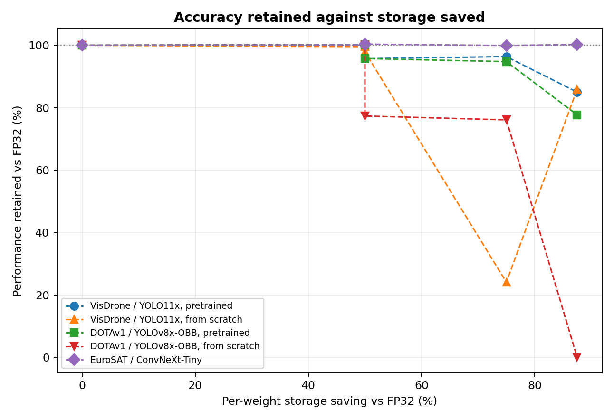
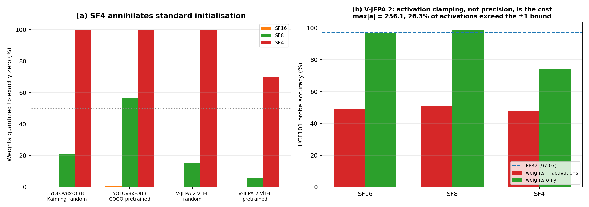
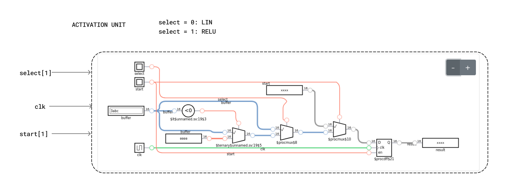
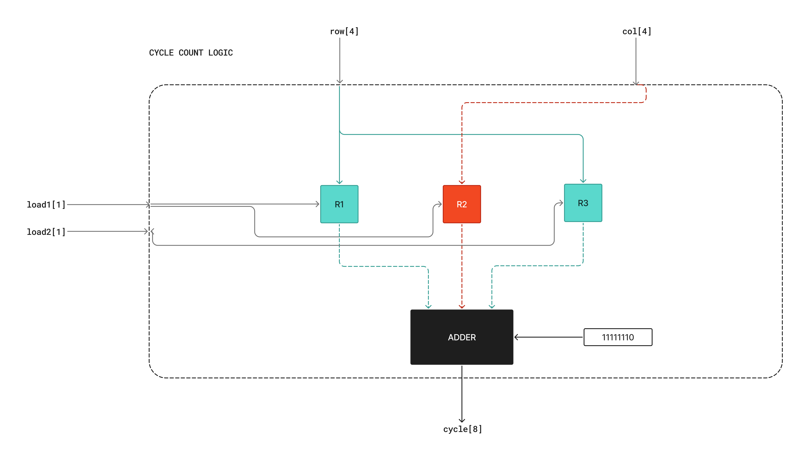

# **Superfloat: Accelerators for AI on Edge. Reimagined.**

This repository contains the code, methods, and scripts for implementing **Superfloat Quantization** and **Lottery Ticket Hypothesis (LTH)** techniques for optimizing neural networks. The repository focuses on various quantization algorithms, model evaluations, and fine-tuning techniques to minimize perplexity and stabilize activations.

---

## **What is Superfloat?**  

**Superfloat** is a custom quantization algorithm that operates with a **scalable precision format**. Unlike traditional floating-point systems (IEEE-754), Superfloat removes the mantissa entirely and focuses solely on the **exponent** for precision representation.  

### **Key Features**:  
1. **Sign-Exponent Representation**:  
   - Superfloat (SFx) uses `1 bit` for the **sign** and allocates the remaining `x-1 bits` for the **exponent**.  
   - For instance, in **SF16**:  
     - 1 bit → Sign  
     - 15 bits → Exponent  

2. **Clamping Range**:  
   - All values are clamped within the range `[-1, 1]`. This ensures activation and parameter stability, reducing the likelihood of exploding or vanishing gradients.

3. **Bit-width Flexibility**:  
   - Superfloat supports variable precision formats, scaling between **3-bit and 16-bit**:  
     - Lower precision (e.g., **SF4**) → Faster computation, reduced model size.  
     - Higher precision (e.g., **SF16**) → Improved accuracy while maintaining efficient quantization.

4. **Gradient and Activation Capping**:  
   - To stabilize the training process, gradients and activations are **capped** at -1 and +1.

### **Advantages of Superfloat**:  
- Saves **precision** without a significant drop in accuracy.  
- Reduces **computational complexity** compared to traditional floating-point representations.  
- Allows adaptive scaling for diverse quantization requirements.

---

**Conversion FP32 - SF(4-16)**

A standard 32-bit floating-point number is converted into a custom superfloat representation with a variable-sized mantissa.

- **Clamp Input Range** – The input value is restricted to the range (-1, 1). If the value exceeds this, it is set to a predefined maximum value.
    
- **Extract Sign Bit** – The sign bit is determined and stored separately, while the value is converted to its absolute form.
    
- **Compute Mantissa** – The fractional value is scaled by `2^mantissa_bits` to convert it into an integer representation.
    
- **Bit Packing** – The sign bit and mantissa are arranged into a custom format, with the mantissa shifted to fit within a float-sized bit structure.
    
- **Bitwise Reinterpretation** – The constructed bit pattern is reinterpreted as a floating-point number and returned.

---
## **What is WASQ?**  

**WASQ** stands for **Weight and Activation Superfloat Quantization**. It is a **hybrid quantization framework** that leverages Superfloat precision to optimize both model weights and activations.

### **Key Characteristics of WASQ**:  
1. **Weight Quantization**:  
   - Model weights are converted to **Superfloat precision** (SFx) without requiring complex computations like mantissa adjustments.  

2. **Activation Quantization**:  
   - Activations are clamped and quantized within a stable range to prevent issues such as exploding activations.

3. **Optimization Algorithms**:  
   - WASQ includes customized algorithms like **WASQ OPT** and **Full Parameter Method (FPM)** to balance accuracy and convergence speed.
   - New: **Simulated Annealing Multi-Prize Lottery Ticket (SA-MPLTH)** algorithm for healing quantized models

4. **Scalability**:  
   - WASQ supports **multi-bit quantization** (from 4-bit to 16-bit), making it adaptable for different deployment environments, such as:  
     - **Edge devices** → Lower precision for speed and memory savings.  
     - **Servers** → Higher precision for accuracy-sensitive tasks.

### **WASQ + Lottery Ticket Hypothesis (LTH)**  
WASQ integrates **LTH** to identify specific weights that are critical for maintaining model performance after quantization. By fine-tuning only the **essential weights**, WASQ reduces computational overhead while achieving high accuracy.

---

## **Files Overview**

1. **[Quant_Dequant.ipynb](Quant_Dequant.ipynb)**  
   Contains the implementation of basic Superfloat quantization and dequantization functions.

2. **[sf16quant.ipynb](sf16quant.ipynb)**  
   Builds on Superfloat quantization functions, specifically for **SF16 precision**.

3. **[lth_analysis.py](lth_analysis.py)**  
   Analyzes **activation magnitude distribution** for **LTH**. It compares activation patterns of original and quantized models.

4. **[lth_trainer.py](lth_trainer.py)**  
   The **LTH trainer** script for fine-tuning models based on the Lottery Ticket Hypothesis technique.

5. **[wasq_eval.py](wasq_eval.py)**  
   Calculates **perplexity** for a series of models, grouped by context length, epochs, or model species.

6. **[wasq_inference.py](wasq_inference.py)**  
   Provides inference capabilities for **individual** or **multiple WASQ-quantized models**.

7. **[wasq_fasteropt.py](wasq_fasteropt.py)**  
   An optimized version of the **OPT algorithm** implemented in `wasq_opt.py`.

8. **[wasq_opt.py](wasq_opt.py)**  
   Core implementation of the WASQ OPT algorithm.

9. **[wasq_fpm.py](wasq_fpm.py)**  
   Implements the **Full Parameter Method** (FPM) for WASQ quantization.

10. **[wasq_vanilla.py](wasq_vanilla.py)**  
    Baseline implementation of the **Vanilla algorithm** for WASQ.

11. **[sa_mplth.py](sa_mplth.py)**  
    New: Implements Simulated Annealing Multi-Prize Lottery Ticket Hypothesis for healing quantized models.

12. **[assets/results](assets/results/)**  
    Contains outputs of model tests, perplexity scores, and supplementary studies.

---

## **Scaling Laws**

### 1. **Maximum Context Length Barrier - Perplexity Factor**  
For a model with `n` parameters, a calibration dataset of maximum input length `c`, **three-shot quantization fine-tuning**, and Superfloat precision bit `x` (where `4 ≤ x ≤ 16`):  

\[
P = f(n, c, 3, x)
\]

- **Lower P** indicates better model understanding and calibration performance.

---

### 2. **Maximum Neuron Spread Factor**  
This scaling law uses the **Lottery Ticket Hypothesis** for WASQ quantization to stabilize activations:

1. Perform a forward pass using the **original model** and record the average magnitudes of activations across all layers.  
2. Perform the same for the **vanilla quantized model** to observe how quantization impacts activation magnitudes.  
3. Rank layers based on the **difference in activation magnitudes** between the original and quantized models.  
4. Identify and **cluster layers** with significant deviations to address issues like exploding/vanishing activations.  
5. Fine-tune or analyze these clusters to ensure stable activations and minimal performance degradation.

The law establishes that the **maximum neuron spread** (region targeted for fine-tuning/updating) is a function of:  
- **Activation magnitude**  
- **Activation fracture** (spread of how a weight affects neighboring weights during backpropagation)

---

## **Quantization Algorithms**

The repository explores three quantization approaches:

1. **Superfloat Precision**: Custom precision without mantissa, clamped within `[-1, 1]` for stability.  
2. **WASQ OPT**: Optimized quantization with faster convergence.  
3. **Full Parameter Method (FPM)**: Retrains all parameters for higher accuracy.
4. **SA-MPLTH**: New simulated annealing approach for healing quantized models.

---

## **Usage**

### **Setup**  
Clone the repository and install dependencies:

```bash
git clone https://github.com/aloshdenny/superfloat
cd superfloat
pip install -r requirements.txt
```

### **Running Scripts**  

- Train with **LTH**:  
   ```bash
   python lth_trainer.py
   ```

- Evaluate Perplexity:  
   ```bash
   python wasq_eval.py
   ```

- Perform Inference:  
   ```bash
   python wasq_inference.py
   ```

- Run SA-MPLTH:  
   ```bash
   python sa_mplth.py
   ```

---

## **Benchmarks**

[`benchmarks/`](benchmarks/) evaluates SFx across four architecture families
with FP32 and FP16 reference rows trained in the same pipeline, so the
quantization cost is measured rather than cited. Full tables and failure-mode
analyses: [SUPERFLOAT_RESULTS.md](SUPERFLOAT_RESULTS.md). Scripts and Modal
apps: [benchmarks/README.md](benchmarks/README.md).


### Results measured in this repository

| Domain | Model | Dataset | SF16 vs FP32 |
| --- | --- | --- | --- |
| Remote sensing classification | ConvNeXt-Tiny | EuroSAT | **+0.1%** (96.43 vs 96.31) |
| UAV object detection | YOLO11x | VisDrone | −4.3% (0.2817 vs 0.2942) |
| Satellite object detection | YOLOv8x-OBB | DOTAv1 | −4.2% (0.4298 vs 0.4489) |
| Video, self-supervised ViT | V-JEPA 2 ViT-L | UCF101 | **+8.1%** (85.56 vs 77.51) |

- **SF8 is indistinguishable from SF16** in every domain (<1% apart, in both
  directions) — 7 significand bits suffice, for a 75% storage reduction.
- **SF8 and SF16 beat full precision on V-JEPA 2** under weights-only
  quantization: 83.91 and 85.56 against an FP32 control at 77.51, on identical
  schedules.
- **SF4 is free on classification** (96.27 ±0.03 vs FP32's 96.31 ±0.55, at
  87.5% storage reduction) but costs 15–22% on dense localisation.
- **99.99993% of trained weights are representable** — 0 of 53.6M YOLO11x
  weights fall outside SF16 range, and only 15 outside SF4's tighter ±0.875.



### Two reproducible failure modes



**Weight quantization is architecture-agnostic; activation quantization is
not.** Clamping activations to [−1, 1] is nearly free after BatchNorm, which
holds CNN activations near unit scale. A ViT residual stream accumulates across
24 blocks: measured max |a| = **256.1**, with **26.3%** of activations outside
the bound across 193 of 292 layers. Quantization-aware training does not
recover it.

**Usable learning rate must match grid resolution, from both sides.** SF8 from
random init diverges at the FP32 recipe's 4e-3 (0.0748 ±0.0017 over 3 seeds)
and trains normally at 1e-3, because its grid is 256× coarser than SF16's. SF4
fails in the opposite direction: standard Kaiming init places weights an order
of magnitude below its 0.0625 floor, zeroing **99.98%** of them at step 0.

### Prior results from the paper

The tables below are from the SuperFloat paper, not re-measured here. They
cover ResNet depths on CIFAR and ImageNet, and the GPT-2/GPT-3 weight
distribution and convergence studies in
[assets/results](assets/results/).

**CIFAR-10 top-1 (%), mean ± std over 3 seeds**

| Format | R20 | R32 | R44 | R56 |
| --- | --- | --- | --- | --- |
| FP32 | 87.4 ±0.1 | 87.7 ±0.1 | 88.4 ±0.2 | 88.5 ±0.3 |
| FP16 | 87.4 ±0.1 | 88.0 ±0.1 | 88.3 ±0.4 | 88.6 ±0.2 |
| SF16 | 86.9 ±0.3 | 86.8 ±0.3 | 71.5 ±10.4 | 47.1 ±12.0 |
| SF8 | 86.8 ±0.2 | 86.9 ±0.1 | 82.7 ±0.5 | 74.1 ±9.9 |
| SF4 | 86.5 ±0.3 | 86.2 ±0.2 | 83.7 ±0.3 | 77.7 ±0.1 |

**CIFAR-100 top-1 (%), mean ± std over 3 seeds**

| Format | R20 | R32 | R44 | R56 |
| --- | --- | --- | --- | --- |
| FP32 | 56.7 ±0.1 | 58.1 ±0.6 | 58.8 ±0.2 | 59.0 ±0.2 |
| FP16 | 57.0 ±0.2 | 58.0 ±0.3 | 58.4 ±0.1 | 58.7 ±0.2 |
| SF16 | 52.7 ±0.7 | 55.4 ±0.3 | 17.3 ±8.1 | 15.5 ±9.2 |
| SF8 | 52.7 ±0.4 | 55.8 ±0.4 | 38.4 ±6.7 | 29.3 ±6.1 |
| SF4 | 51.7 ±0.3 | 54.4 ±0.5 | 48.6 ±1.4 | 36.8 ±1.8 |

**ImageNet-1K top-1 (%), single seed, 50 epochs**

| Format | R20 | R32 | R44 | R56 |
| --- | --- | --- | --- | --- |
| FP32 | 69.4 | 74.3 | 77.3 | 72.6 |
| FP16 | 69.95 | 74.5 | 74.5 | 72.8 |
| SF16 | 69.08 | 65.1 | 62.2 | 63.8 |
| SF8 | 69.17 | 74.1 | 63.9 | 63.5 |
| SF4 | 66.25 | 69.2 | 65.5 | 64.3 |

**Language models.** GPT-2 (124M) and GPT-3 (125M) trained on Fineweb-100B for
1 epoch; weight-distribution plots for GPT-2/3, Llama-2-7B, Mistral-7B,
Qwen2-7B, MiniCPM-V and Japanese StableLM are in
[assets/results/LLM Distribution](assets/results/LLM%20Distribution/), and
YOLOv5/v7 layer-wise distributions alongside them. ~99% of parameters in every
case fall within [−1, 1].

The benchmarks in this repository extend that picture in one important way: the
CIFAR tables show SFx destabilising at depth with large seed variance
(SF16 at R56: 47.1 ±12.0), whereas the modern-architecture results here are
stable, and the instabilities that do appear have identified, reproducible
causes rather than seed dependence.

---

## **assets/Results**

The assets/results folder contains:  
- **Perplexity scores** for different model configurations.  
- **Activation magnitude comparisons** before and after quantization.  
- Supplementary studies showcasing model performance.

---

## **Chip-1: Atreides**

Atreides is an ASIC accelerator designed specifically for Superfloat-based inference. We redesigned the systolic array to support SFx operations, adopting a modded RV32 ISA and faster Fused-Multiply-Adder (FMA) units. The end goal is not convention—it's breaking the rules of computing and physics to achieve faster inference, lower memory consumption, and the same accuracy.

## FMA in Atreides

Below is an image showing the FMA in Atreides:


## Expanded View of Chip-1's Architecture

An expanded view of Chip-1's architecture includes non-unified memory blocks (subject to unification), cache, control store (modded RV32 ISA), and an array of FMAs:


### FPGA Functional Units Design

#### 1. 8 x 16-bit Shift Register (simplified)


#### 2. Activation Unit (simplified)



#### 3. Cycle Count Logic



## Instruction Set

The current instruction set for the FPGA architecture is show below:

| Instruction | Opcode(4) | Op 1(4) | Op 2(4) | Op 3(4) | Description                                                                           |
|-------------|-----------|---------|---------|---------|---------------------------------------------------------------------------------------|
| STR         | 0001      | addr    | row     | col     | Stores the matrix data from activation unit buffer into specified address in memory   |
| LDR         | 0010      | addr    | row     | col     | Loads the matrix at addr into the Row Shift Buffer                                    |
| LDC         | 0011      | addr    | row     | col     | Loads the matrix at addr into the Column Shift Buffer                                 |
| MATMUL      | 0100      | -       | -       | -       | Performs matrix multiplication using data in Row Shift Buffer and Column Shift Buffer |
| RELU        | 0101      | -       | -       | -       | Performs ReLU activation function on Systolic Array output                            |
| LIN         | 0110      | -       | -       | -       | Performs Linear activation function on Systolic Array output                          |
| NOP         | 0000      | -       | -       | -       | No Operation                                                                          |

### FPGA floorplan (ISA integrated)

The FPGA floorplan integrated with instruction set is shown below:


---

## **Contributions**

Contributions are welcome! Feel free to open issues or submit pull requests.

---

## **Sponsors**

We would like to thank our sponsors for their support:

<div style="display: flex; justify-content: space-between;">
  
  
  
  
</div>

---

## **License**

This project is licensed under the MIT License.
