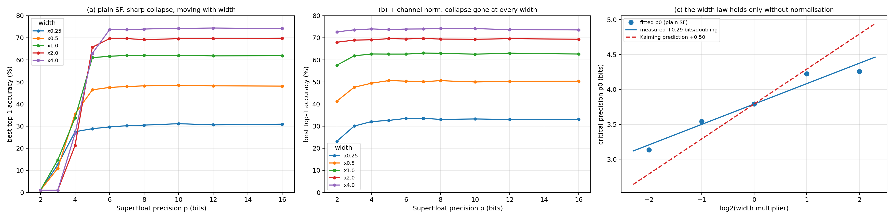
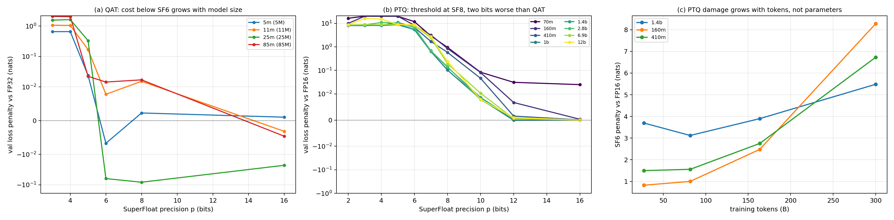
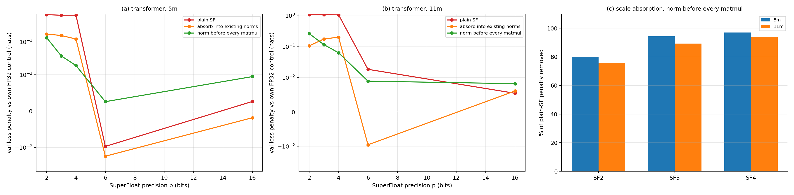

# SuperFloat precision scaling study

How far SuperFloat can be pushed, measured rather than argued, across four
experiment tiers and 500 runs.

| tier | question | substrate | runs |
| --- | --- | --- | --- |
| A | how does QAT cost scale with model size? | GPT, 4.7M-85M non-embedding params, FineWeb-Edu | 34 |
| B | how does PTQ cost scale with size *and* data? | Pythia 70M-12B, incl. intermediate checkpoints | 172 |
| C | where does a network stop training, and why? | ResNet-20, width x0.25-x4, CIFAR-100 | 258 |
| D | can the tier C fix be carried to transformers? | GPT 4.7M / 10.6M, three block designs | 36 |

Everything below is weights-only quantization with an FP32/FP16 head, and every
penalty is measured against a control trained in the **same** condition. That
last point is not a formality: tier D's `ln_full` mode adds two norms per block
and is a different architecture, worth 0.17-0.25 nats on its own. Compared
against the wrong baseline it appears to "recover more than 100%" of the
quantization penalty, which is how the effect first presented itself.

---

## 1. The headline

**Precision was never the binding constraint. Scale placement was.**

The floor that tiers A-C measured -- SF6 for QAT, SF8 for PTQ, total collapse
below SF4 -- is not a property of the number format. It is an artifact of
trained weights being far smaller than the grid step. Fix that, with a scale
that never enters the inference arithmetic, and the floor drops by 2-4 bits.

| regime | floor before | floor after |
| --- | --- | --- |
| CNN, QAT from scratch | SF5-SF6 | **SF2** (within 1.5 pp of SF16) |
| Transformer, QAT from scratch | SF6 | **SF3-SF4** (0.02-0.12 nats) |
| Transformer, PTQ | SF8 | not tested |

Both fixes keep the matmul holding exact SF grid values. The scale lives in the
normalisation layer, which on Atreides sits outside the systolic array, so
registers and the MAC array still compute only in SF range.

---

## 2. Tier C: the width law, and why it dissolves

### 2.1 The measurement

ResNet-20 at five width multipliers x ten precisions x three seeds, CIFAR-100,
60 epochs, everything fixed except width and precision.

Best top-1 accuracy, mean over 3 seeds:

| width | SF2 | SF3 | SF4 | SF5 | SF6 | SF8 | SF16 |
| --- | --- | --- | --- | --- | --- | --- | --- |
| x0.25 | 1.0 | 12.5 | 27.5 | 28.8 | 29.6 | 30.5 | 30.9 |
| x0.5 | 1.0 | 10.9 | 35.5 | 46.4 | 47.5 | 48.2 | 48.1 |
| x1.0 | 1.0 | 14.7 | 33.7 | 61.0 | 61.6 | 62.0 | 61.9 |
| x2.0 | 1.0 | 1.0 | 21.2 | 65.7 | 69.6 | 69.2 | 69.8 |
| x4.0 | 1.0 | 1.0 | 26.7 | 62.9 | 73.7 | 73.9 | 74.2 |

The collapse is sharp, and it moves right as the network widens. Seed spread
never exceeds 2.2 pp anywhere in the grid, including at the knee.

### 2.2 The prediction, and how it failed

A weight quantizes to exactly zero when `|w| < Delta/2`, `Delta = 2^-(p-1)`.
Kaiming init has `sigma = sqrt(2/fan_in)`, so the precision at which a fixed
fraction of weights survives is

```
p* = log2(1/sigma) + c = 0.5 * log2(fan_in) + c'
```

i.e. **+0.5 bits per doubling of width**, under any fixed survival criterion --
the criterion only moves the intercept.

Measured, via the inflection of a logistic fitted per width (a threshold-based
knee is not safe here: across four reasonable thresholds the slope ranges +0.08
to +0.37 on this same data, which measures the analyst rather than the format):

```
p0 = +0.29 * log2(width) + 3.79
```

Over the full 16x width range p0 rises **+1.12 bits against the +2.00
predicted** -- 56% of prediction. Two caveats that belong with that number: the
fit's residuals grow when the widest point is included (a single exponent
does not describe the range), and the integer precision grid cannot resolve two
p0 values that fall inside the same one-bit interval, which is what happens at
x2.0 and x4.0.

The mechanism data explains the shortfall. Dead-weight tolerance at the knee
*rises* with width -- 91.2%, 94.3%, 97.8% -- so wider networks survive on a
smaller surviving fraction, partly cancelling the shrinking sigma.

### 2.3 The fix

Normalise each output channel before quantization: quantize `w/s_c` instead of
`w`. Since every conv is followed by BatchNorm, and BatchNorm is invariant to
per-output-channel scaling of its input, `s_c` is absorbed there and never
appears in the conv arithmetic.

| width | SF2 plain | SF2 + norm | SF3 plain | SF3 + norm |
| --- | --- | --- | --- | --- |
| x0.25 | 1.0 | **23.2** | 12.5 | **30.0** |
| x0.5 | 1.0 | **41.3** | 10.9 | **47.6** |
| x1.0 | 1.0 | **57.6** | 14.7 | **61.8** |
| x2.0 | 1.0 | **68.0** | 1.0 | **68.9** |
| x4.0 | 1.0 | **72.7** | 1.0 | **73.6** |

At x4.0, ternary weights reach 72.7% against SF16's 73.5%. The collapse is gone
at every width, and the dead fraction at init becomes **width-independent** --
25.0% at SF2, 12.5% at SF3, 6.3% at SF4, identical across all five widths,
where before it ran above 99% and varied strongly with fan-in.

**This retires the width law.** p0 was measuring how far Kaiming init sits below
the grid step, which is a fixable engineering property, not a precision limit.



---

## 3. Tiers A and B: QAT and PTQ on language models

### 3.1 QAT is worth about two bits

Penalty vs FP32, from-scratch training at 10 tokens/param:

| size | N | SF3 | SF4 | SF5 | SF6 | SF8 | SF16 |
| --- | --- | --- | --- | --- | --- | --- | --- |
| 5m | 4.7M | +0.656 | +0.660 | +0.024 | -0.007 | +0.002 | +0.001 |
| 11m | 10.6M | +1.071 | +1.052 | +0.168 | +0.008 | +0.015 | -0.003 |
| 25m | 25.2M | +1.573 | +1.631 | +0.332 | -0.063 | -0.082 | -0.023 |
| 85m | 85.1M | +2.084 | +2.045 | +0.022 | +0.014 | +0.017 | -0.005 |

Below the floor the cost follows a clean law in model size:

```
SF3:  penalty = 1.150 * log10(N) - 7.003    R2 = 0.995
SF4:  penalty = 1.132 * log10(N) - 6.867    R2 = 0.982
```

about **1.14 nats per decade of N** over an 18x range. At and above the floor
there is no trend at all (SF5: R2 = 0.002). So it is specifically the
*sub-threshold* cost that scales, not quantization cost in general.

Seed replication at 25m (3 seeds) confirms both the effect and that the small
negative penalties are noise:

| | mean penalty | seed spread |
| --- | --- | --- |
| SF4 | +1.598 | 0.069 |
| SF5 | +0.344 | 0.052 |
| SF6 | -0.029 | 0.052 |

SF6 is indistinguishable from zero. SF5 at 25m genuinely costs 0.344 nats.

### 3.2 PTQ needs two more bits than QAT

Penalty vs FP16 across the Pythia ladder, all at 300B tokens:

| size | SF8 | SF10 | SF16 |
| --- | --- | --- | --- |
| 70m | +0.955 | +0.084 | +0.025 |
| 160m | +0.856 | +0.081 | +0.000 |
| 410m | +0.584 | +0.046 | +0.000 |
| 1b | **+0.103** | +0.008 | -0.000 |
| 1.4b | +0.136 | +0.009 | +0.000 |
| 2.8b | +0.143 | +0.008 | +0.000 |
| 6.9b | +0.194 | +0.011 | -0.000 |
| 12b | +0.242 | +0.008 | +0.000 |

SF10 and above are free everywhere. SF8 is the practical threshold. SF6 and
below destroy every model tested. The SF8 penalty is **U-shaped in N** with a
minimum near 1B parameters.

### 3.3 Damage is governed by tokens, not parameters

The Pythia intermediate checkpoints give a data axis at fixed model size --
the same model, more training tokens, no retraining required.

SF6 penalty vs FP16:

| tokens | 160m | 410m | 1.4b |
| --- | --- | --- | --- |
| 27B | +0.83 | +1.50 | +3.70 |
| 82B | +1.00 | +1.56 | +3.12 |
| 164B | +2.48 | +2.75 | +3.90 |
| 300B | **+8.27** | **+6.72** | **+5.48** |

A 10x rise in penalty over an 11x rise in tokens at 160m, replicated at 410m.
This confirms the data-dependence result of Kumar et al. (2024) on an
independent format.

The effect **weakens as models grow** -- 10x at 160m, 4.5x at 410m, 1.5x at
1.4b -- which points at tokens-per-parameter rather than tokens as the
governing variable, and explains the U-shape in 3.2: sorted by D/N, the SF6
penalty is minimised around 200-300 tokens/param and rises in both directions.



---

## 4. Tier D: carrying the fix to transformers

The CNN fix does not transfer directly. BatchNorm undoes a per-**output**-channel
scale; LayerNorm normalises across features and matmul outputs enter a residual
stream, so a row scale is unrecoverable. What is exactly recoverable is a
per-**input**-channel scale, absorbed by the norm that feeds the matmul:

```
(W/g) . (LN(z).gamma.g + beta.g)  ==  W . (LN(z).gamma + beta)
```

Fold `gamma' = gamma*g` and `beta' = beta*g` at deployment and the matmul holds
pure SF values. Verified numerically: reconstructing the deployed model
reproduces the training-time forward to **2.3e-05** on outputs spanning +/-60,
with **0 of 98,304 weights off the SF3 grid**.

Three modes: `none` (plain SF), `ln` (fold into the norms that already exist,
covering q/k/v and mlp.0 -- q/k/v share one `g` since they read the same norm),
and `ln_full` (add a norm before `proj` and `mlp.2` so every matmul is fed by
one).

Penalty vs that mode's own FP32 control:

| size | mode | FP32 | SF2 | SF3 | SF4 | SF6 | SF16 |
| --- | --- | --- | --- | --- | --- | --- | --- |
| 5m | none | 6.9600 | +0.683 | +0.656 | +0.660 | -0.010 | +0.003 |
| 5m | ln | 6.9618 | +0.175 | +0.157 | +0.123 | -0.018 | -0.002 |
| 5m | **ln_full** | 6.7952 | +0.136 | **+0.038** | **+0.019** | +0.003 | +0.009 |
| 11m | none | 6.3096 | +1.085 | +1.083 | +1.064 | +0.018 | +0.005 |
| 11m | ln | 6.3148 | +0.106 | +0.177 | +0.202 | -0.010 | +0.006 |
| 11m | **ln_full** | 6.0629 | +0.263 | **+0.116** | **+0.063** | +0.009 | +0.008 |

Fraction of the plain-SF penalty removed:

| size | mode | SF2 | SF3 | SF4 |
| --- | --- | --- | --- | --- |
| 5m | ln | 74% | 76% | 81% |
| 5m | ln_full | 80% | **94%** | **97%** |
| 11m | ln | 90% | 84% | 81% |
| 11m | ln_full | 76% | **89%** | **94%** |

**The transformer QAT floor moves from SF6 to SF3-SF4**, replicated at two
sizes, with inference arithmetic unchanged.



Two things not to over-read. `ln_full`'s FP32 control is 0.165 (5m) and 0.247
(11m) nats better than `none`'s -- the extra norms help independently of
quantization, which is why per-mode controls are load-bearing here. And the
non-monotonicities within a mode (11m `ln` has SF2 better than SF4) sit at
~0.1 nats against a ~0.05 nat seed spread; these are single-seed runs and the
ordering between adjacent precisions is not resolvable.

---

## 5. What is not established

- **The width exponent.** +1.12 bits over 16x width is solid; a single exponent
  is not. The integer precision grid cannot resolve p0 differences below ~1 bit,
  and the slope drifts with fitting range. A continuously-scaled grid would fix
  this.
- **85m SF5.** Penalties run +0.024, +0.168, +0.344 (3 seeds), then +0.022 at
  85m. With 25m confirmed over three seeds, 85m is the odd point, and its
  replication was cut off by budget. Left open rather than extrapolated.
- **Tier A has one seed per config** except the 25m replication, so small
  negative penalties there are not distinguishable from noise.
- **PTQ under scale absorption** was never run. Given SF4 PTQ destroys every
  model tested, it is the obvious next experiment.
- **Activation quantization** is out of scope throughout; the V-JEPA
  measurement in [SUPERFLOAT_RESULTS.md](SUPERFLOAT_RESULTS.md) shows why.
- **Half-Chinchilla token budget** (10 tokens/param). Relative degradation at
  matched (N, D) is unaffected, but absolute losses are not compute-optimal.
- **Embedding init** uses PyTorch's default N(0,1) rather than GPT-2's
  N(0,0.02), so validation loss starts near 465 before recovering. Identical
  across every precision and seed, so comparisons hold, but it wastes part of
  the token budget on a transient.

---

## 6. Method notes

**GPU selection was measured, not assumed** (`modal/modal_profile.py`). Cost per
unit of work, not throughput, decides: an L40S is best value for the CNN sweep
and an H100 for both LM tiers, while the B200 loses every tier -- 1.32x worse
value than H100 on tier A, being only 1.2x faster for 1.6x the price.

**Four bugs in this study produced plausible numbers rather than errors**, and
three were caught by auditing machinery that had not yet produced a result:

1. `np.memmap(mode="w+")` sizes its file up front, so a killed tokenizer leaves
   a full-size file whose tail is zeros. The existence check would have accepted
   it and trained on zero padding. Now checks content, at both prep and train.
2. `nn.MultiheadAttention` keeps QKV as a raw `Parameter`, not an `nn.Linear`,
   so `apply_superfloat` never saw it and 25% of every block stayed FP32 -- a
   run labelled SF4 was not SF4. Now explicit q/k/v/proj linears, with a
   runtime assertion on the converted-layer count.
3. Leaving the LM head in fp16 covers 37% of pythia-70m but 2% of pythia-12b,
   which would have manufactured a "degradation grows with N" trend -- the very
   claim tier B exists to test. Measured at **7.64 nats** on 70m at SF4. The
   head is now quantized by default and coverage is recorded per run.
4. A `transformers` rename (`embed_out` -> `lm_head` between 5.6 and 5.15) made
   the head-exclusion control silently do nothing. Now matches both names and
   raises unless exactly one head module is found.

**Reproducibility.** `runs_scaling_*` JSON records carry the full per-epoch
history, the dead-weight fraction, and the coverage fraction for every run.

---

## 7. Files

```
benchmarks/
  modal/modal_profile.py       GPU fitting: cost per unit work, per tier
  modal/modal_scaling_a.py     tier A, QAT LM ladder
  modal/modal_scaling_b.py     tier B, PTQ over Pythia + checkpoints
  modal/modal_scaling_c.py     tier C, width sweep + channel normalisation
  modal/modal_scaling_d.py     tier D, transformer scale absorption
  analyze_scaling.py           logistic fit of p0, width law
  make_scaling_figures.py      the three figures above
```
