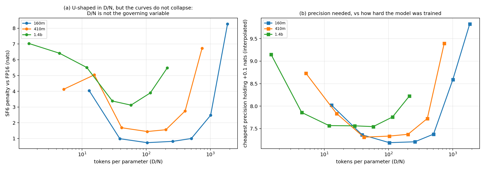
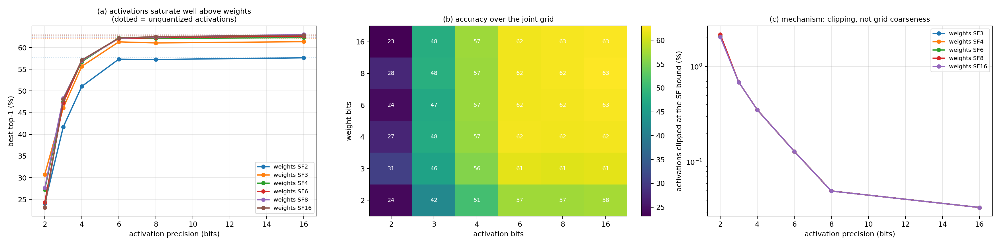
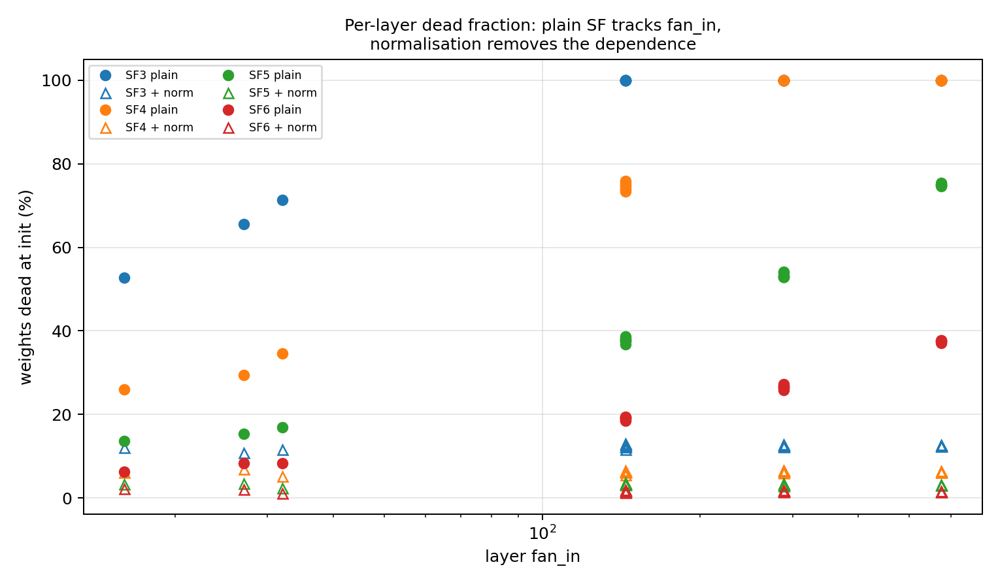
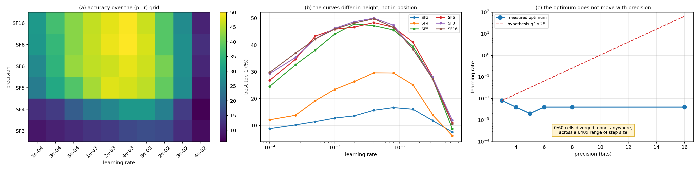

# SuperFloat precision scaling study

How far SuperFloat can be pushed, measured rather than argued, across four
experiment tiers and 509 runs.

| tier | question | substrate | runs |
| --- | --- | --- | --- |
| A | how does QAT cost scale with model size? | GPT, 4.7M-85M non-embedding params, FineWeb-Edu | 35 |
| B | how does PTQ cost scale with size *and* data? | Pythia 70M-12B, incl. intermediate checkpoints | 172 |
| C | where does a network stop training, and why? | ResNet-20, width x0.25-x4, CIFAR-100 | 258 |
| D | can the tier C fix be carried to transformers? | GPT 4.7M / 10.6M, three block designs | 44 |

Everything below is weights-only quantization with an FP32/FP16 head, and every
penalty is measured against a control trained in the **same** condition. That
last point is not a formality: tier D's `ln_full` mode adds two norms per block
and is a different architecture, worth 0.17-0.25 nats on its own. Compared
against the wrong baseline it appears to "recover more than 100%" of the
quantization penalty, which is how the effect first presented itself.

---

## 1. The headline

**Precision was never the binding constraint. Scale placement was.**

The floor that tiers A-C measured -- SF6 for QAT, SF8 for PTQ, total collapse
below SF4 -- is not a property of the number format. It is an artifact of
trained weights being far smaller than the grid step. Fix that, with a scale
that never enters the inference arithmetic, and the floor drops by 2-4 bits.

| regime | floor before | floor after |
| --- | --- | --- |
| CNN, QAT from scratch | SF5-SF6 | **SF2** (within 1.5 pp of SF16) |
| Transformer, QAT from scratch | SF6 | **SF3-SF4** (0.02-0.12 nats) |
| Transformer, PTQ | SF8 | not tested |

Both fixes keep the matmul holding exact SF grid values. The scale lives in the
normalisation layer, which on Atreides sits outside the systolic array, so
registers and the MAC array still compute only in SF range.

---

## 2. Tier C: the width law, and why it dissolves

### 2.1 The measurement

ResNet-20 at five width multipliers x ten precisions x three seeds, CIFAR-100,
60 epochs, everything fixed except width and precision.

Best top-1 accuracy, mean over 3 seeds:

| width | SF2 | SF3 | SF4 | SF5 | SF6 | SF8 | SF16 |
| --- | --- | --- | --- | --- | --- | --- | --- |
| x0.25 | 1.0 | 12.5 | 27.5 | 28.8 | 29.6 | 30.5 | 30.9 |
| x0.5 | 1.0 | 10.9 | 35.5 | 46.4 | 47.5 | 48.2 | 48.1 |
| x1.0 | 1.0 | 14.7 | 33.7 | 61.0 | 61.6 | 62.0 | 61.9 |
| x2.0 | 1.0 | 1.0 | 21.2 | 65.7 | 69.6 | 69.2 | 69.8 |
| x4.0 | 1.0 | 1.0 | 26.7 | 62.9 | 73.7 | 73.9 | 74.2 |

The collapse is sharp, and it moves right as the network widens. Seed spread
never exceeds 2.2 pp anywhere in the grid, including at the knee.

### 2.2 The prediction, and how it failed

A weight quantizes to exactly zero when `|w| < Delta/2`, `Delta = 2^-(p-1)`.
Kaiming init has `sigma = sqrt(2/fan_in)`, so the precision at which a fixed
fraction of weights survives is

```
p* = log2(1/sigma) + c = 0.5 * log2(fan_in) + c'
```

i.e. **+0.5 bits per doubling of width**, under any fixed survival criterion --
the criterion only moves the intercept.

Measured, via the inflection of a logistic fitted per width (a threshold-based
knee is not safe here: across four reasonable thresholds the slope ranges +0.08
to +0.37 on this same data, which measures the analyst rather than the format):

```
p0 = +0.29 * log2(width) + 3.79
```

Over the full 16x width range p0 rises **+1.12 bits against the +2.00
predicted** -- 56% of prediction. Two caveats that belong with that number: the
fit's residuals grow when the widest point is included (a single exponent
does not describe the range), and the integer precision grid cannot resolve two
p0 values that fall inside the same one-bit interval, which is what happens at
x2.0 and x4.0.

The mechanism data explains the shortfall. Dead-weight tolerance at the knee
*rises* with width -- 91.2%, 94.3%, 97.8% -- so wider networks survive on a
smaller surviving fraction, partly cancelling the shrinking sigma.

### 2.3 The fix

Normalise each output channel before quantization: quantize `w/s_c` instead of
`w`. Since every conv is followed by BatchNorm, and BatchNorm is invariant to
per-output-channel scaling of its input, `s_c` is absorbed there and never
appears in the conv arithmetic.

| width | SF2 plain | SF2 + norm | SF3 plain | SF3 + norm |
| --- | --- | --- | --- | --- |
| x0.25 | 1.0 | **23.2** | 12.5 | **30.0** |
| x0.5 | 1.0 | **41.3** | 10.9 | **47.6** |
| x1.0 | 1.0 | **57.6** | 14.7 | **61.8** |
| x2.0 | 1.0 | **68.0** | 1.0 | **68.9** |
| x4.0 | 1.0 | **72.7** | 1.0 | **73.6** |

At x4.0, ternary weights reach 72.7% against SF16's 73.5%. The collapse is gone
at every width, and the dead fraction at init becomes **width-independent** --
25.0% at SF2, 12.5% at SF3, 6.3% at SF4, identical across all five widths,
where before it ran above 99% and varied strongly with fan-in.

**This retires the width law.** p0 was measuring how far Kaiming init sits below
the grid step, which is a fixable engineering property, not a precision limit.


---

## 3. Tiers A and B: QAT and PTQ on language models

### 3.1 QAT is worth about two bits

Penalty vs FP32, from-scratch training at 10 tokens/param:

| size | N | SF3 | SF4 | SF5 | SF6 | SF8 | SF16 |
| --- | --- | --- | --- | --- | --- | --- | --- |
| 5m | 4.7M | +0.656 | +0.660 | +0.024 | -0.007 | +0.002 | +0.001 |
| 11m | 10.6M | +1.071 | +1.052 | +0.168 | +0.008 | +0.015 | -0.003 |
| 25m | 25.2M | +1.573 | +1.631 | +0.332 | -0.063 | -0.082 | -0.023 |
| 85m | 85.1M | +2.084 | +2.045 | +0.022 | +0.014 | +0.017 | -0.005 |

Below the floor the cost follows a clean law in model size:

```
SF3:  penalty = 1.150 * log10(N) - 7.003    R2 = 0.995
SF4:  penalty = 1.132 * log10(N) - 6.867    R2 = 0.982
```

about **1.14 nats per decade of N** over an 18x range. At and above the floor
there is no trend at all (SF5: R2 = 0.002). So it is specifically the
*sub-threshold* cost that scales, not quantization cost in general.

Seed replication at 25m (3 seeds) confirms both the effect and that the small
negative penalties are noise:

| 25m | mean penalty | seed spread |
| --- | --- | --- |
| SF4 | +1.598 | 0.069 |
| SF5 | +0.344 | 0.052 |
| SF6 | -0.029 | 0.052 |

SF6 is indistinguishable from zero. SF5 at 25m genuinely costs 0.344 nats.

**The 85m SF5 point is not an outlier.** A second seed gives 3.8762 against
seed 0's 3.8612, i.e. a mean penalty of **+0.030 with a spread of 0.015** --
smaller than the eval noise itself (0.032 nats, taken as the std of the last
five evaluations within a run). So SF5 is free at 85m and costs 0.344 nats at
25m, both measured over multiple seeds. The non-monotonicity in N is real:

| size | SF5 penalty | seeds |
| --- | --- | --- |
| 5m | +0.024 | 1 |
| 11m | +0.168 | 1 |
| 25m | **+0.344** | 3 (spread 0.052) |
| 85m | **+0.030** | 2 (spread 0.015, at the noise floor) |

We have no mechanism for it. It is reported because it replicates, not because
it is understood.

### 3.2 PTQ needs two more bits than QAT

Penalty vs FP16 across the Pythia ladder, all at 300B tokens:

| size | SF8 | SF10 | SF16 |
| --- | --- | --- | --- |
| 70m | +0.955 | +0.084 | +0.025 |
| 160m | +0.856 | +0.081 | +0.000 |
| 410m | +0.584 | +0.046 | +0.000 |
| 1b | **+0.103** | +0.008 | -0.000 |
| 1.4b | +0.136 | +0.009 | +0.000 |
| 2.8b | +0.143 | +0.008 | +0.000 |
| 6.9b | +0.194 | +0.011 | -0.000 |
| 12b | +0.242 | +0.008 | +0.000 |

SF10 and above are free everywhere. SF8 is the practical threshold. SF6 and
below destroy every model tested. The SF8 penalty is **U-shaped in N** with a
minimum near 1B parameters.

### 3.3 Damage is U-shaped in training tokens

The Pythia intermediate checkpoints give a data axis at fixed model size: the
same model, more training tokens, no retraining required.

An earlier version of this study sampled only the last four checkpoints and
read the result as monotone growth in tokens. Extending the sweep to seven
checkpoints spanning 2.1B to 300B tokens, and to seven precisions, shows that
rise is the right-hand half of a U. SF7 penalty vs FP16, in nats:

| tokens | 160m | 410m | 1.4b |
| --- | --- | --- | --- |
| 2.1B | +0.60 | +3.79 | +4.49 |
| 6.3B | +0.18 | +0.35 | +0.62 |
| 16.8B | +0.13 | +0.17 | +0.25 |
| 41.9B | **+0.13** | **+0.17** | +0.24 |
| 81.8B | +0.20 | +0.18 | **+0.24** |
| 163.6B | +0.56 | +0.34 | +0.32 |
| 299.9B | +3.16 | +1.70 | +0.69 |

SF8 traces the same curve an order of magnitude lower, with its minimum in the
same place, so the shape is a property of the checkpoint rather than of one
precision:

| tokens | 160m | 410m | 1.4b |
| --- | --- | --- | --- |
| 2.1B | +0.11 | +0.40 | +1.08 |
| 16.8B | +0.03 | **+0.03** | +0.05 |
| 81.8B | **+0.03** | +0.04 | **+0.05** |
| 299.9B | +0.86 | +0.58 | +0.14 |

**The left branch.** The most fragile point in a model's life is the start of
it. At 2.1B tokens the 1.4b model loses 4.49 nats at SF7, nineteen times its
own minimum, and 1.08 nats even at SF8. Fragility then falls by more than an
order of magnitude within the first 17B tokens. Early weights have not yet
settled into the scale the trained network uses, so a fixed grid clips and
rounds a much larger fraction of them.

**The right branch.** The rise is concentrated in the final two checkpoints,
steps 78000 and 143000 of 143000, which is exactly where Pythia's cosine
schedule decays the learning rate to zero. Measuring each model against its
own minimum rather than against the others:

| model | final D/N | min SF7 | final SF7 | amplification |
| --- | --- | --- | --- | --- |
| 160m | 3528 tok/param | +0.13 | +3.16 | 25x |
| 410m | 993 tok/param | +0.17 | +1.70 | 10x |
| 1.4b | 248 tok/param | +0.24 | +0.69 | 2.9x |

The amplification is ordered by tokens-per-parameter. The absolute penalty is
not: the 1.4b model at 248 tok/param is worse than the 160m at 197, so D/N does
not collapse the curves and is not by itself the governing variable. What it
orders is how far a model's fragility is amplified by the end of its own
schedule.

This is the same direction as the data-dependence result of Kumar et al.
(2024), measured on an independent format, but it locates the effect more
precisely: it is not that training tokens steadily degrade quantizability, it
is that the two ends of a training run are fragile and the middle is not.

Converting that into the currency that matters, the cheapest precision that
holds the penalty under 0.1 nats, interpolated across the tested grid:

| model | at its best checkpoint | at its final checkpoint | cost of over-training |
| --- | --- | --- | --- |
| 160m | 7.2 bits | 9.7 bits | 2.5 bits |
| 410m | 7.3 bits | 9.4 bits | 2.1 bits |
| 1.4b | 7.5 bits | 8.2 bits | 0.7 bits |

Training a 160m model to 300B tokens buys lower FP16 loss and costs two and a
half bits of deployable precision.



**Practical consequence.** The worst checkpoint to quantize is the one that
ships. The same model taken from the middle of its schedule tolerates PTQ 3x
to 25x better, with the gap widening the further past compute-optimal the model
is trained.

**Caveat.** Learning-rate decay and over-training are confounded along a single
training run: both advance together, and nothing here separates them. Tier E
(3.4) varies D/N with each run completing its own schedule, which holds decay
fixed while D/N moves, but it does so under QAT on a 5M model rather than PTQ
on Pythia. A clean separation needs Pythia-scale runs with the schedule
truncated at matched token counts, which was not affordable here.


---

## 4. Tier D: carrying the fix to transformers

The CNN fix does not transfer directly. BatchNorm undoes a per-**output**-channel
scale; LayerNorm normalises across features and matmul outputs enter a residual
stream, so a row scale is unrecoverable. What is exactly recoverable is a
per-**input**-channel scale, absorbed by the norm that feeds the matmul:

```
(W/g) . (LN(z).gamma.g + beta.g)  ==  W . (LN(z).gamma + beta)
```

Fold `gamma' = gamma*g` and `beta' = beta*g` at deployment and the matmul holds
pure SF values. Verified numerically: reconstructing the deployed model
reproduces the training-time forward to **2.3e-05** on outputs spanning +/-60,
with **0 of 98,304 weights off the SF3 grid**.

Three modes: `none` (plain SF), `ln` (fold into the norms that already exist,
covering q/k/v and mlp.0 -- q/k/v share one `g` since they read the same norm),
and `ln_full` (add a norm before `proj` and `mlp.2` so every matmul is fed by
one).

Penalty vs that mode's own FP32 control:

| size | mode | FP32 | SF2 | SF3 | SF4 | SF6 | SF16 |
| --- | --- | --- | --- | --- | --- | --- | --- |
| 5m | none | 6.9600 | +0.683 | +0.656 | +0.660 | -0.010 | +0.003 |
| 5m | ln | 6.9618 | +0.175 | +0.157 | +0.123 | -0.018 | -0.002 |
| 5m | **ln_full** | 6.7952 | +0.136 | **+0.038** | **+0.019** | +0.003 | +0.009 |
| 11m | none | 6.3096 | +1.085 | +1.083 | +1.064 | +0.018 | +0.005 |
| 11m | ln | 6.3148 | +0.106 | +0.177 | +0.202 | -0.010 | +0.006 |
| 11m | **ln_full** | 6.0629 | +0.263 | **+0.116** | **+0.063** | +0.009 | +0.008 |

Fraction of the plain-SF penalty removed:

| size | mode | SF2 | SF3 | SF4 |
| --- | --- | --- | --- | --- |
| 5m | ln | 74% | 76% | 81% |
| 5m | ln_full | 80% | **94%** | **97%** |
| 11m | ln | 90% | 84% | 81% |
| 11m | ln_full | 76% | **89%** | **94%** |

**The transformer QAT floor moves from SF6 to SF3-SF4**, replicated at two
sizes, with inference arithmetic unchanged.


`ln_full`'s FP32 control is 0.165 (5m) and 0.247 (11m) nats better than
`none`'s -- the extra norms help independently of quantization, which is why
per-mode controls are load-bearing here.

### 4.1 Under scale absorption, coarser grids do better

The ordering within `ln` at 11m inverts, and three seeds show it is not noise:

| | seed 0 | seed 1 | seed 2 | mean penalty | spread |
| --- | --- | --- | --- | --- | --- |
| SF2 | 6.4204 | 6.4265 | 6.4527 | **+0.108** | 0.013 |
| SF3 | 6.4921 | 6.4552 | 6.4847 | **+0.152** | 0.047 |
| SF4 | 6.5167 | 6.5057 | 6.5153 | **+0.187** | 0.024 |

Fewer bits is consistently better, in every seed, with a SF2-to-SF4 gap of
0.079 nats against a worst-case spread of 0.047.

Read this narrowly. All three remain *above* their FP32 control, so this is
not ternary beating full precision; it is that among quantized options under
scale absorption, the coarsest grid lands closest to FP32. The natural
explanation is regularisation -- an 11m model on 106M tokens is
over-parameterised for its budget, and a coarser grid constrains it harder --
and it is consistent with SF2 being exactly ternary, the BitNet operating
point. But this is one architecture at one size, so it is a measured effect
with a hypothesis attached, not a mechanism.

---

## 5. Follow-up experiments

The four tiers established that scale placement, not precision, sets the floor.
Seven follow-ups ask where the remaining precision actually goes. All run on
CIFAR-100 with the channel normalisation of 2.3 unless stated otherwise, so the
weights they report are exact SF grid values at inference.

### 5.1 Activations, not weights, are the binding constraint

Everything so far quantized weights only. Sweeping weight and activation
precision jointly over the full 42-cell grid, best top-1:

| w \ a | a2 | a3 | a4 | a6 | a8 | a16 | none |
| --- | --- | --- | --- | --- | --- | --- | --- |
| SF2 | 24.0 | 41.7 | 51.1 | 57.3 | 57.3 | 57.6 | 57.9 |
| SF3 | 30.7 | 46.1 | 55.7 | 61.3 | 61.1 | 61.4 | 62.1 |
| SF4 | 27.3 | 47.5 | 56.8 | 62.3 | 62.1 | 62.3 | 62.7 |
| SF6 | 24.3 | 47.3 | 57.0 | 62.1 | 62.3 | 62.6 | 62.9 |
| SF8 | 27.6 | 48.3 | 57.0 | 62.1 | 62.5 | 63.0 | 62.3 |
| SF16 | 23.1 | 48.0 | 57.1 | 62.2 | 62.5 | 62.8 | 62.9 |

The two axes are not symmetric. Holding activations exact, weights saturate at
SF3 and are fully converged by SF4: 62.1 at SF3 against 62.9 at SF16. Holding
weights exact, activations need SF6: 48.0 at SF3, 57.1 at SF4, 62.2 at SF6.
Below SF6 activations the weight precision stops mattering at all, because
every row of the a3 column lands within 2 points of every other.

The cause is clipping, not grid coarseness. The fraction of activations
landing outside the SF representable bound falls from 2.0% at SF2 to 0.03% at
SF16, and the curve is identical for every weight precision. Activations are
one-sided and heavy-tailed after ReLU, so a symmetric fixed-range format spends
half its codes on values that never occur and clips the tail that carries the
signal. Weights, which are roughly symmetric and light-tailed, have no such
problem.

**The activation scale is absorbable too.** The sweep divides activations by a
per-tensor EMA of their maximum before quantizing, which would be a scale
factor inside the datapath if it had to be applied there. It does not. The
activation entering a conv comes out of the preceding BatchNorm and ReLU, and
ReLU is positively homogeneous, so for a scalar s > 0

    ReLU(gamma.xhat + beta) / s  ==  ReLU((gamma/s).xhat + beta/s)

and folding gamma' = gamma/s, beta' = beta/s makes the preceding norm emit
already-scaled activations. The conv output is then scaled by 1/s, which the
following BatchNorm absorbs exactly as it absorbs the weight channel scale of
2.3. Only the first conv has no preceding norm, and there the scale folds into
the input normalisation, which is preprocessing rather than datapath. Both
operands reach the systolic array as exact SF grid values.

**Consequence for hardware.** An SF datapath wants an asymmetric split: 3 to 4
bits on the weight operand, 6 on the activation operand. A design that
allocates both operands the same width is overspending on weights and
underspending where the accuracy actually is.



### 5.2 Per-layer evidence for the scale-placement account

Section 2.3 argued the collapse was a scale mismatch: Kaiming initialisation
sets sigma = sqrt(2/fan_in), which shrinks as layers widen, while the SF grid
stays fixed, so wide layers initialise entirely inside the first quantization
bin. Measuring the dead fraction, weights with |w| < Delta/2, layer by layer
at initialisation tests that directly.

Dead weights at init, plain SF / with channel normalisation:

| fan_in | SF3 | SF4 | SF5 | SF6 |
| --- | --- | --- | --- | --- |
| 16 | 52.7 / 12.1 | 26.0 / 6.1 | 13.7 / 3.3 | 6.2 / 2.1 |
| 27 | 65.5 / 10.9 | 29.4 / 6.9 | 15.3 / 3.5 | 8.3 / 2.1 |
| 32 | 71.4 / 11.6 | 34.5 / 5.2 | 16.9 / 2.4 | 8.3 / 1.1 |
| 144 | 100.0 / 12.5 | 74.6 / 6.2 | 37.8 / 3.3 | 19.0 / 1.7 |
| 288 | 100.0 / 12.5 | 100.0 / 6.4 | 53.3 / 3.2 | 26.6 / 1.7 |
| 576 | 100.0 / 12.5 | 100.0 / 6.3 | 75.0 / 3.1 | 37.5 / 1.5 |

Plain SF does exactly what the account predicts. At SF3 every layer with
fan_in at or above 144 is 100% dead at initialisation: the network starts as
an exactly zero function and no gradient can revive it, which is the collapse
seen in 2.1 and nothing to do with representational capacity.

Under normalisation the fan_in dependence vanishes. Every column is flat, and
the remaining dead fraction depends only on precision, halving with each added
bit: 12.5%, 6.3%, 3.2%, 1.6%. That is precisely what a fixed Delta/2 threshold
on a fixed-shape distribution gives, and it is the signature of a format whose
grid is now matched to the weights it has to hold.



### 5.3 Learning rate does not need retuning with precision

An early observation in this study, never formalised: SF8 from random init
diverged at the FP32 recipe's 4e-3 while SF16 tolerated it. If the usable step
size is set by grid resolution, then eta*(p) ~ 2^p, and one fewer bit halves
the usable learning rate. SF3 should then tolerate about 1/8000 of SF16's step.

Sixty cells, six precisions crossed with ten learning rates spanning 1e-4 to
6e-2, a 640x range:

| | 1e-4 | 5e-4 | 2e-3 | 4e-3 | 8e-3 | 2e-2 | 6e-2 | best lr |
| --- | --- | --- | --- | --- | --- | --- | --- | --- |
| SF3 | 8.8 | 11.4 | 13.6 | 15.7 | **16.7** | 16.0 | 7.6 | 8e-3 |
| SF4 | 12.1 | 19.2 | 26.4 | **29.6** | 29.6 | 25.1 | 6.2 | 4e-3 |
| SF5 | 24.6 | 38.0 | **47.8** | 47.2 | 45.6 | 39.5 | 8.8 | 2e-3 |
| SF6 | 26.8 | 43.3 | 46.7 | **48.4** | 46.6 | 41.0 | 10.9 | 4e-3 |
| SF8 | 29.3 | 42.3 | 48.7 | **50.0** | 47.4 | 38.4 | 12.0 | 4e-3 |
| SF16 | 29.8 | 42.2 | 48.2 | **49.8** | 46.6 | 38.4 | 10.6 | 4e-3 |

**Not one cell in sixty diverged**, at any precision, anywhere in a 640x range
of step size. The optimum sits at 4e-3 for SF4, SF6, SF8 and SF16 alike, and
SF3's optimum is 8e-3, twice SF16's rather than a fraction of it. The curves
differ in height, not in position.

The hypothesis is refuted, not merely unconfirmed, over this range. The
original SF8 divergence is better explained by the scale mismatch of 2.3, which
was present in that run and is corrected here: once each channel is normalised
the network no longer initialises near zero, and the fragility that looked like
a step-size limit disappears with it.

**Practical consequence.** Precision and learning rate can be tuned
independently. A recipe developed at FP32 transfers to SF4 without a learning
rate search, which removes the most expensive part of adopting a low-precision
format.



## 6. What is not established

- **The width exponent.** +1.12 bits over 16x width is solid; a single exponent
  is not. The integer precision grid cannot resolve p0 differences below ~1 bit,
  and the slope drifts with fitting range. A continuously-scaled grid would fix
  this.
- **Tier A has one seed per config** except the 25m and 85m-SF5 replications,
  so small negative penalties elsewhere are not distinguishable from noise.
- **The SF5 non-monotonicity in N is unexplained.** It replicates (see 3.1) but
  no mechanism is offered.
- **The inverted precision ordering under scale absorption** (4.1) is measured
  at one architecture and one size.
- **PTQ under scale absorption** was never run. Given SF4 PTQ destroys every
  model tested, it is the obvious next experiment.
- **Activation quantization** is out of scope for the four tiers; 5.1 measures
  it directly on CIFAR-100, and the V-JEPA measurement in
  [SUPERFLOAT_RESULTS.md](SUPERFLOAT_RESULTS.md) shows why it matters.
- **The follow-ups of 5.1, 5.2, 5.3 are CIFAR-100 ResNets only.** The
  weight/activation asymmetry is the one most likely to be architecture
  specific: it rests on activations being one-sided and heavy-tailed after
  ReLU, and a transformer's post-GELU and residual-stream activations are
  differently shaped. It is untested there.
- **The learning-rate result is measured on 12-epoch runs.** Short runs are
  enough to expose divergence, which is what was being looked for, but a
  configuration that survives 12 epochs at 6e-2 could still fail over 60. The
  claim is that no precision-dependent stability boundary exists in this
  window, not that any of these learning rates is a good idea.
- **Half-Chinchilla token budget** (10 tokens/param). Relative degradation at
  matched (N, D) is unaffected, but absolute losses are not compute-optimal.
- **Embedding init** uses PyTorch's default N(0,1) rather than GPT-2's
  N(0,0.02), so validation loss starts near 465 before recovering. Identical
  across every precision and seed, so comparisons hold, but it wastes part of
  the token budget on a transient.

---

## 7. Method notes

**GPU selection was measured, not assumed** (`modal/modal_profile.py`). Cost per
unit of work, not throughput, decides: an L40S is best value for the CNN sweep
and an H100 for both LM tiers, while the B200 loses every tier -- 1.32x worse
value than H100 on tier A, being only 1.2x faster for 1.6x the price.

**Four bugs in this study produced plausible numbers rather than errors**, and
three were caught by auditing machinery that had not yet produced a result:

1. `np.memmap(mode="w+")` sizes its file up front, so a killed tokenizer leaves
   a full-size file whose tail is zeros. The existence check would have accepted
   it and trained on zero padding. Now checks content, at both prep and train.
2. `nn.MultiheadAttention` keeps QKV as a raw `Parameter`, not an `nn.Linear`,
   so `apply_superfloat` never saw it and 25% of every block stayed FP32 -- a
   run labelled SF4 was not SF4. Now explicit q/k/v/proj linears, with a
   runtime assertion on the converted-layer count.
3. Leaving the LM head in fp16 covers 37% of pythia-70m but 2% of pythia-12b,
   which would have manufactured a "degradation grows with N" trend -- the very
   claim tier B exists to test. Measured at **7.64 nats** on 70m at SF4. The
   head is now quantized by default and coverage is recorded per run.
4. A `transformers` rename (`embed_out` -> `lm_head` between 5.6 and 5.15) made
   the head-exclusion control silently do nothing. Now matches both names and
   raises unless exactly one head module is found.

**Reproducibility.** `runs_scaling_*` JSON records carry the full per-epoch
history, the dead-weight fraction, and the coverage fraction for every run.

---

## 8. Files

```
benchmarks/
  modal/modal_profile.py       GPU fitting: cost per unit work, per tier
  modal/modal_scaling_a.py     tier A, QAT LM ladder
  modal/modal_scaling_b.py     tier B, PTQ over Pythia + checkpoints
  modal/modal_scaling_c.py     tier C, width sweep + channel normalisation
  modal/modal_scaling_d.py     tier D, transformer scale absorption
  lab/exp1_act.py              weight/activation precision grid; also the
                               model and loader for experiments 4, 6 and 7
  lab/exp2_dn.py               PTQ over Pythia checkpoints, 7 x 7 grid
  lab/exp3_reg.py              precision as regulariser, across D/N
  lab/exp5_alloc.py            per-layer dead-weight profile
  lab/exp6_lr.py               (precision, learning rate) stability grid
  lab/README.md                what each experiment asks, and how to run it
  analyze_scaling.py           logistic fit of p0, width law
  make_scaling_figures.py      the four-tier figures
  make_lab_figures.py          the follow-up figures
  results/                     every raw result, one JSONL per experiment
```

Regenerating every figure from the raw results:

```bash
cd benchmarks
python make_scaling_figures.py --results-dir results --out figures/
python make_lab_figures.py     --results-dir results --out figures/
```
